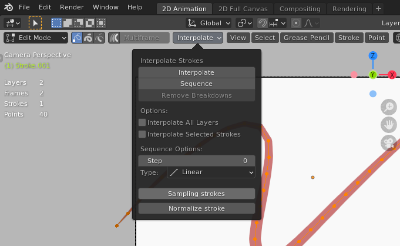

# Blender Gpencil Normalizer

gpencilのストロークのポイント数を任意に調整する機能を提供します。

## Usage
メニューは `gpencilオブジェクト > 編集モード > 補間` 内にあります。
### Sampling strokes
選択ストロークを任意のポイント数にサンプリングします。  
実行時に3dビュー左下にオペレータが出るので好きな数字を入れてください。

### Normalize strokes
選択レイヤー内のすべてのストロークを、ペア内(フレームをまたいで同じインデックスのストローク同士のこと)で一番ポイント数が多いストロークに合わせてサンプリングします。

これにより、フリーハンドストローク同士の補間（中割生成）が可能になります。